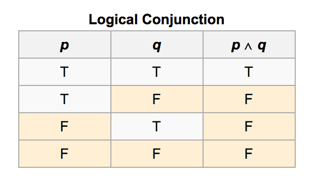
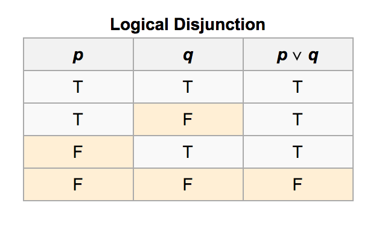
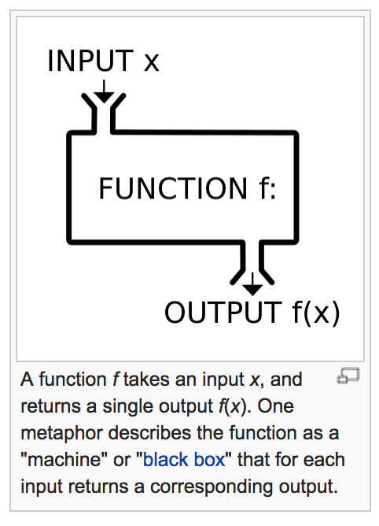

# FEWD LESSON 10

## FEWD - JS Review and Scopes

### Instructors
Kevin Bluer & Jimmy Wong


## Agenda

* Quick review of JS basics
  * Values, Types and Operators
  * Expressions vs Statements
  * Control Structures
  * Functions
* Variable scoping
* Build an image carousal


## Use the source dudes!

Open up Chrome Devtool's Console or Codepen to experiment with JS. It's not gonna bite.


## Values and Types

* Numbers
* Strings
* Booleans


## Numbers

```javascript
1
1.1
+00000009
-2311231.12312
```


## Strings

```javascript
'hello'
"world"
'hello world'
"hello world"
"\"hello world\"\n"
```


## Booleans

```javascript
true
false
```


## Operators

* Arithmetic operators
* Logical operators
* Comparison operators


## Arithmetic operators

[MDN Reference on Arithmetic Operators](https://developer.mozilla.org/en-US/docs/Web/JavaScript/Reference/Operators/Arithmetic_Operators)

* Binary Operators
  * +
  * -
  * \*
  * /
  * % (modulus)
* Unary operators
  * \+ (positive)
  * \- (negative)
  * ++ (increment)
  * -- (decrement)


## Logical operators

* &&
* ||
* !


## Truth Table

&& means logical conjunction, AKA ***AND***




## Truth Table

|| means logical disjunction, AKA ***OR***  (not to be confused with exclusive or)




## Truth Table

! means negation


## Comparision Operators

* == (equals)
* != (not equals)
* >
* <
* \>=
* <=
* === (identical)
* !== (not identical)


### Expressions vs Statements


## Expressions

```javascript
1 + 2
```

```javascript
"hello" + "world"
```


## Statements

```javascript
1;
"hello world";
```


## Assignment Statements

```javascript
var greeting = "hello world";
var three = 1 + 2;
```


## Conditional Statements

```javascript
var a = 1;

if (a == 2) {
	console.log('a equals 2');
}
else if (a == 1) { // optional
	console.log('a equals 1');
}
else { // optional
	console.log('a not equals 1 or 2');
}
```


## Looping Statements

While loop

```javascript
var i = 0;

while (i < 10) {
	console.log(i);
	i++;
}
```


## Looping Statements

For loop

```javascript
for (var i = 0; i < 10; i++) {
	console.log(i);
}
```


## Function Calls

```javascript
console.log("hello world");
```

What's a function?


## Functions



Like math, a function is a black box, it takes some input and returns some output.


## Function Declaration

```javascript
function sum(a, b) {
	return a + b;
}
```


## Using a Function

```javascript
var three = sum(1, 2);
```

Binary operators are just functions that take 2 parameters.


## Variable scoping

[Eloquent Javascript Ch 3](http://eloquentjavascript.net/03_functions.html)

* local scope
* global scope
* function scope
* nested scope


## Local vs Global Scope

[Codepen](http://codepen.io/wyuenho/pen/Ceytz?editors=001)


## Function Scope 

[Codepen](http://codepen.io/wyuenho/pen/vpizw?editors=001)


## Let's build a carousal

[Codepen](http://codepen.io/wyuenho/pen/HCtov)


## Homework

[Read Eloquent Javascript Introduction to Chapter 3](http://eloquentjavascript.net/)
